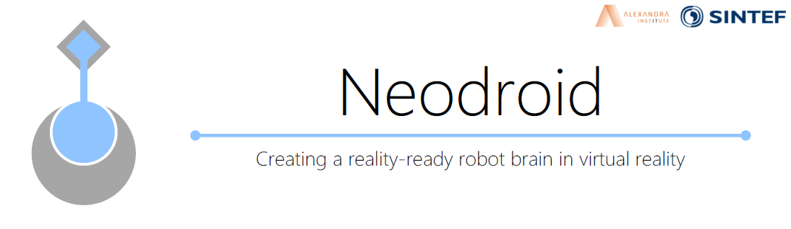
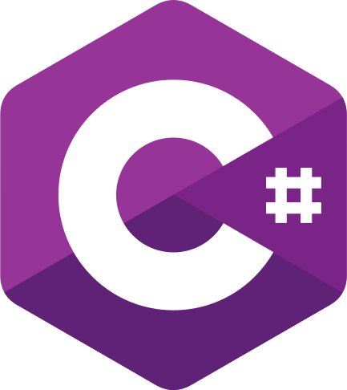
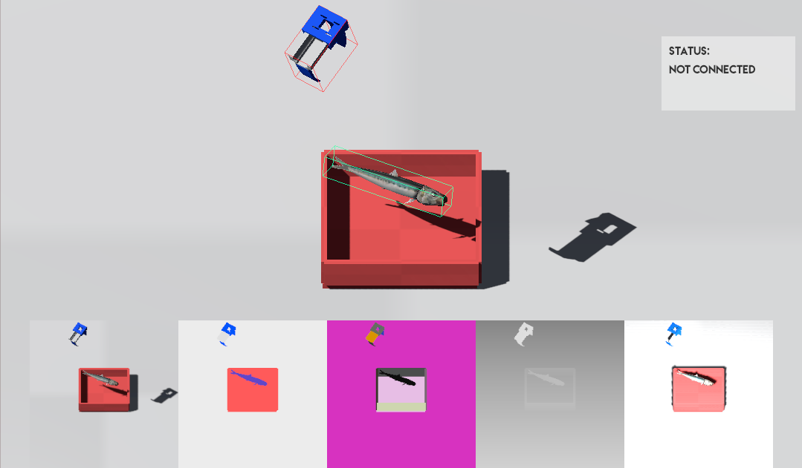
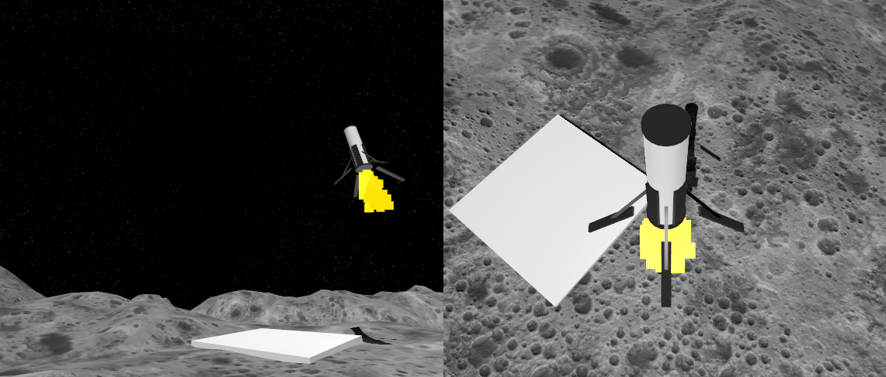

# Droid

Droid is a unity package that enables prototyping reinforcement learning environments within the [Unity](https://unity3d.com/) engine and communication to the [Neo](https://github.com/sintefneodroid/neo) counterpart of the [Neodroid](https://github.com/sintefneodroid) platform.

---

_[Neodroid](https://github.com/sintefneodroid) is developed with support from Research Council of Norway Grant #262900. ([https://www.forskningsradet.no/prosjektbanken/#/project/NFR/262900](https://www.forskningsradet.no/prosjektbanken/#/project/NFR/262900))_

---


<table>
  <tr>
    <td>
      <a href='https://travis-ci.org/sintefneodroid/droid'>
        
      </a>
    </td>
    <td>
      <a href='https://coveralls.io/github/sintefneodroid/droid?branch=master'>
        
      </a>
    </td>
    <td>
      <a href='https://github.com/sintefneodroid/droid/issues'>
        
      </a>
    </td>
    <td>
      <a href='https://github.com/sintefneodroid/droid/network'>
        
      </a>
    </td>
      <td>
      <a href='https://github.com/sintefneodroid/droid/stargazers'>
        
      </a>
    </td>
      <td>
      <a href='https://github.com/sintefneodroid/droid/blob/master/LICENSE.md'>
        
      </a>
    </td>
  </tr>
</table>

<p align="center" width="100%">
  <a href="https://unity3d.com/">
    
  </a>
  <a href="https://docs.microsoft.com/en-us/dotnet/csharp/index">
    
  </a>
  <a href="https://github.com/zeromq/netmq">
    
  </a>
</p>
<p align="center" width="100%">
  <a href="https://github.com/google/flatbuffers">
    
  </a>
</p>

This project has similarities with Unity's own project [Unity Machine Learning Agents](https://github.com/Unity-Technologies/ml-agents). Most of the efforts done in this project were made prior to their announcement, [Introducing: Unity Machine Learning Agents](https://blogs.unity3d.com/2017/09/19/introducing-unity-machine-learning-agents/), when the authors was in need of a capable tool. Newcomers wanting a more supported experience may wish to use the [Unity Machine Learning Agents](https://github.com/Unity-Technologies/ml-agents) project instead.

The entire Neodroid platform serves as a tool for academic research specific to the authors interests, hence explaining the existence and future direction of this project.

## Notable Features

- In-editor simulations for ease of debugging
- Connect multiple external agents (i.e. multiple client computers)
- Blazing fast serialisation <!-- (see [benchmark](.github/BENCHMARK.MD)) -->
- Modular unity style component construction of scenes (enables rapid prototyping of complex
environments and ease of integration with existing projects)
- Support reverse curriculum generation inherently
(Ability to reinitialise any previous seen state or configure new ones)

## Usage

- Edit your Unity projects "Packages/manifest.json" to include the string 
  `"com.neodroid.droid": "https://github.com/sintefneodroid/droid.git"}`.
  
  Example `manifest.json`
  ````
  {
    "dependencies": {
      "com.unity.package-manager-ui": "0.0.0-builtin",
      ...
      "com.neodroid.droid": "https://github.com/sintefneodroid/droid.git",
    }
  }
  ````
  You can use `"com.neodroid.droid": "https://github.com/sintefneodroid/droid.git#branch"` for a specific branch.

***Or***

- Download the newest Droid.unitypackage from [releases](https://github.com/sintefneodroid/droid/releases) and import into your Unity project.

***Or***

- Acquire the [Droid (Temporarily down)](http://u3d.as/14cC) package from the built-in asset store of the Unity Editor.

## Demo
<!--

-->


### Videoes
[](https://www.youtube.com/watch?v=niYacuKt8cs)
[](https://www.youtube.com/watch?v=PVc5T_YIHdk)
[](https://www.youtube.com/watch?v=c6IDgzMhGNk)
[](https://www.youtube.com/watch?v=d13xndC4BAk)

## Repository Structure
---
<!--        ├  └  ─  │        -->
    sintefneodroid/droid         # This repository
    │
    ├── Samples                  # Prebuilt Neodroid environments
    │   └── MultiArmedBandit     # Sample Project
    │
    ├── Editor                   # Editor Implementation
    │   ├── GameObjects
    │   ├── ScriptableObjects
    │   ├── Windows
    │   ├── Resources
    │   └── Utilies
    │
    ├── Runtime                 # Runtime Implementation
    │   ├── Prototyping         # All classes for quick prototyping of observations and actions
    │   │   ├── Actors
    │   │   ├── Evaluation
    │   │   ├── Observers
    │   │   ├── Displayers
    │   │   ├── Configurables
    │   │   └── Motors
    │   │
    │   ├── Environments        # Classes for encapsulating all Neodroid environments
    │   ├── Managers            # Classes for managing the simulation of Neodroid environments
    │   └── Utilities           # Lots of helper functionalities
    │
    ├── Documentation           # Unity Package Documentation
    │
    ├── Gizmos                  # Icons
    │
    ├── Tests                   # Tests
    │
    ├── .github                 # Images and such for this README
    │
    ├── LICENSE.md              # License file (Important but boring)
    ├── README.md               # The top-level README
    └── TUTORIAL.md             # Very quick tutorial to get started
---

# Citation

For citation you may use the following bibtex entry:
````
@misc{neodroid,
  author = {Heider, Christian},
  title = {Neodroid Platform},
  year = {2018},
  publisher = {GitHub},
  journal = {GitHub repository},
  howpublished = {\url{https://github.com/sintefneodroid}},
}
````
# Other Components Of The Neodroid Platform
- [agent](https://github.com/sintefneodroid/agent)
- [neo](https://github.com/sintefneodroid/neo)
